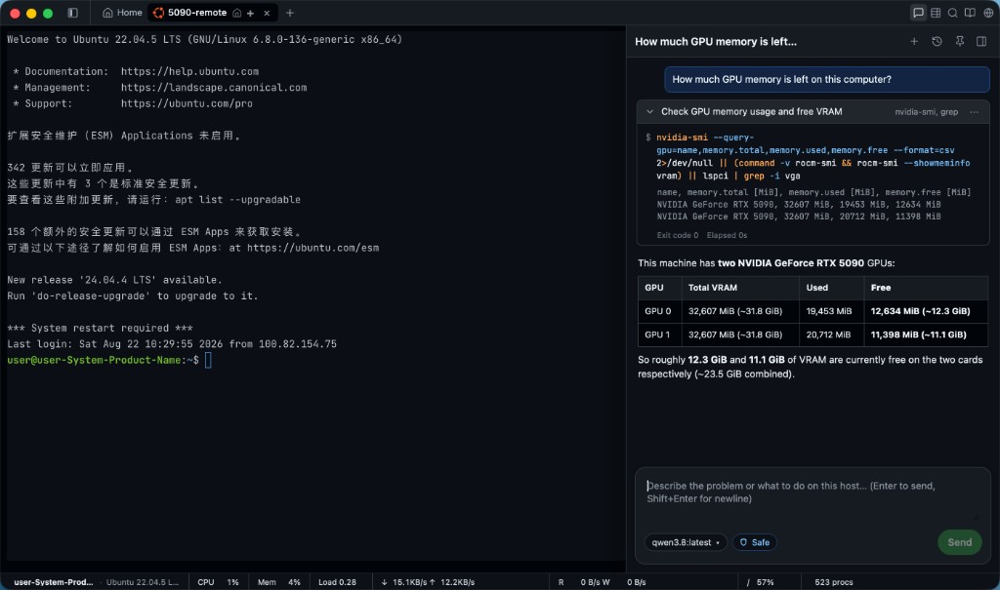
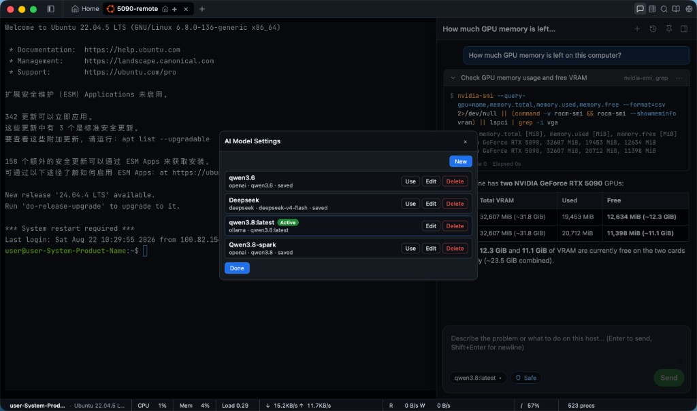

# TerminalWisely

  

**English** | [中文](./README.zh-CN.md)

**SSH terminal + Kubernetes workbench + AI Linux / K8S Engineers.** Connect to your servers, browse clusters from local kubeconfig or SSH kubectl, work with files in a visual workspace, and describe problems in plain language — the built-in agent investigates on the **live session or selected cluster**, runs read-only checks automatically, and asks before anything mutates.

[Download](https://github.com/wiselyman/TerminalWisely/releases) · [Build from source](./BUILD.md)

  

---

## What you get

| Area | Highlights |
|------|------------|
| **Terminal** | Multi-tab SSH, bookmarks, reconnect, English / 中文 UI |
| **Kubernetes** | Sidebar Hosts ↔ K8s; add cluster via + (file or paste kubeconfig) or SSH kubectl; resource tree, YAML, logs, Pod shell. App can download latest kubectl/Helm into its data dir (or use PATH / SSH). Not a full Lens clone |
| **Files** | Drag-and-drop upload, click `ls` paths to `cd` or preview, download, compress, cross-server send |
| **AI Engineer** | Linux mode on SSH hosts; K8S mode on selected clusters; separate chat history |
| **Models** | OpenAI-compatible APIs, Ollama, Anthropic-compatible gateways, Gemini |
| **Safety** | Policy-graded commands (read / mutate / deny); approval cards; stop anytime |
| **Insight** | Host CPU, memory, disk I/O, and network on the status bar |

  

---

## AI Linux Engineer & AI K8S Engineer

Open **AI Engineer** from the title bar. The mode follows the sidebar:

- **Hosts** → **AI Linux Engineer** on the connected SSH session (`terminal_exec`)
- **K8s** → **AI K8S Engineer** on the selected cluster (`k8s_list` / `k8s_get` / `k8s_logs` / …)

- **Same session / cluster** — no hidden second SSH login; kubectl jumps use the bound session.
- **Evidence first** — the agent reads output before concluding.
- **You stay in control** — read-only probes can run on their own; writes need your explicit approval.
- **Bring your model** — save multiple profiles (cloud or local) and switch the active one in Settings.

### Example asks

| You say | What happens |
|---------|----------------|
| “Find what’s eating disk” | `df` / `du` drill-down (Linux) |
| “Who listens on 8080?” | Socket / process lookup; kill only after approval |
| “Why is this Pod CrashLooping?” | `k8s_describe` / `k8s_logs` on the selected cluster |
| “Scale api to 3” | `k8s_scale` after approval |

---

## Terminal & files

- **Upload** — drop files onto the terminal or tab → SFTP to the current directory  
- **Navigate** — click directory names in `ls` output  
- **Preview & edit** — click file paths; syntax highlight and search for text  
- **Download** — Ctrl/Cmd + click a path, or use the context menu  
- **Send elsewhere** — right-click a path, or drag to another SSH tab  
- **Command Nav** — 90+ ops snippets inserted into the shell (never auto-run)

---

## Quick start

1. Add an SSH host in the sidebar and connect — or switch the activity bar to **K8s** and click **+** to add a cluster (kubeconfig file or paste).  
2. Optional: open **AI Engineer** → Settings → add a model profile (Base URL + model id; Ollama often needs no key).  
3. Use the terminal or K8s workbench as usual; ask the AI when you want help.  
4. Approve or reject any command the agent marks as a system change.

Kubernetes notes: TerminalWisely calls `kubectl` on your machine or SSH jump host. It does **not** ship kubectl or Helm binaries. The K8s UI is a practical subset inspired by Lens — not a full Lens IDE.

---

## Download

Installers for **Windows**, **macOS** (Apple Silicon & Intel), and **Linux** (deb, rpm, AppImage; x86_64 & ARM64) are on the [Releases](https://github.com/wiselyman/TerminalWisely/releases) page.

The AI runtime ships inside the app. The first time you open AI Engineer, dependencies install automatically in the background (progress is shown in the UI).

---

## License

[MIT](./LICENSE)
