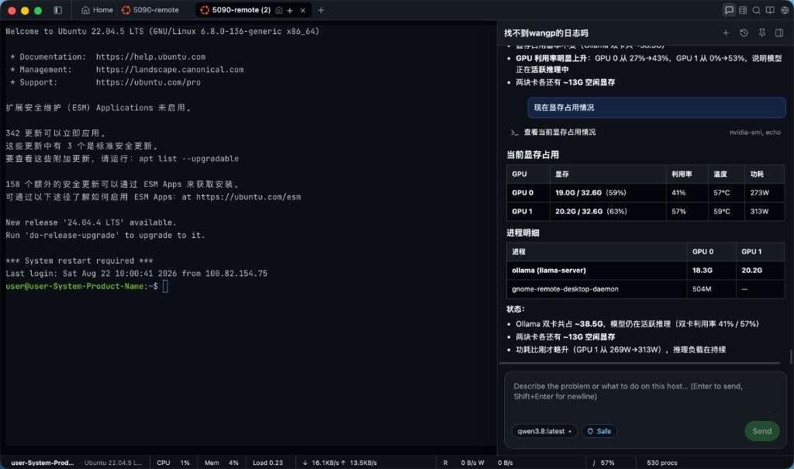
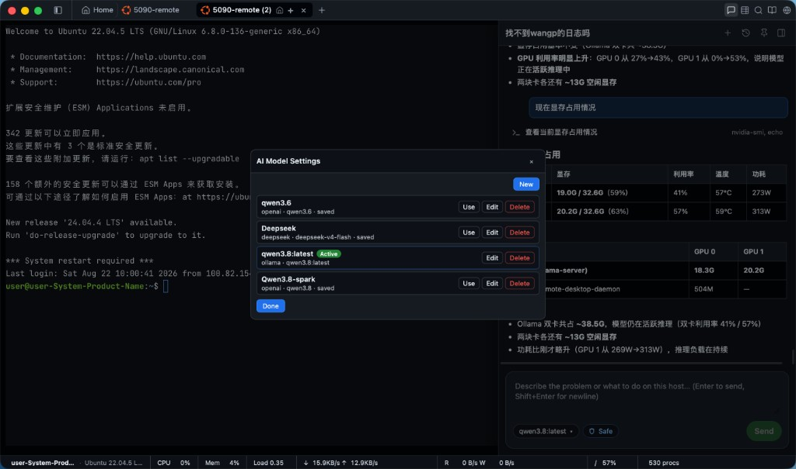

# TerminalWisely

  

[English](./README.md) | **中文**

**SSH 终端 + Kubernetes 工作台 + AI Linux / K8S Engineer。** 连接服务器，从本机 kubeconfig 或 SSH kubectl 浏览集群，在可视化工作区里管理文件，用自然语言描述问题——内置 Agent 在**当前会话或所选集群**上排查，只读检查自动执行，任何会改动系统的操作都会先请你批准。

[下载安装包](https://github.com/wiselyman/TerminalWisely/releases) · [自行构建](./BUILD.md)

  

---

## 能做什么

| 模块 | 能力 |
|------|------|
| **终端** | 多标签 SSH、书签、断线重连、中英文界面 |
| **Kubernetes** | 侧栏 Hosts ↔ K8s；+ 添加集群（文件或粘贴 kubeconfig）或 SSH kubectl；资源树、YAML、日志、Pod Shell。可一键把最新 kubectl/Helm 装到应用目录（也可用 PATH / SSH）。非完整 Lens 复刻 |
| **文件** | 拖拽上传、`ls` 点击进目录或预览、下载、压缩、跨服务器发送 |
| **AI 工程师** | Hosts 为 Linux 模式；K8s 为 K8S 模式；聊天历史按主机/集群隔离 |
| **模型** | OpenAI 兼容、Ollama、Anthropic 兼容网关、Gemini |
| **安全** | 命令能力分级（只读 / 变更 / 拒绝）；批准卡片；随时停止 |
| **可观测** | 状态栏显示 CPU、内存、磁盘读写、网络 |

  

---

## AI Linux Engineer 与 AI K8S Engineer

点击标题栏 **AI 工程师**。模式跟随侧栏：

- **Hosts** → **AI Linux Engineer**（已连接 SSH，`terminal_exec`）
- **K8s** → **AI K8S Engineer**（当前集群，`k8s_*` 工具）

- **同一会话 / 集群** — 不另开静默登录；SSH kubectl 走已绑定会话。  
- **先看证据** — 在真机/集群上读输出再下结论。  
- **你说了算** — 只读探测可自动跑；写删改必须在 UI 上批准。  
- **自带模型** — 设置里保存多套 Profile（云端或本地），一键切换当前模型。

### 可以这样问

| 你说 | 它会 |
|------|------|
| 「磁盘满了，找大目录」 | `df` / `du` 逐层查（Linux） |
| 「8080 谁占着」 | 查监听与进程；结束进程需批准 |
| 「这个 Pod 为什么 CrashLoop」 | 在所选集群上 `k8s_describe` / `k8s_logs` |
| 「把 api 扩到 3 副本」 | 批准后 `k8s_scale` |
| 「nginx 502」 | 状态、日志、上游检查 |
| 「现在显存多少」 | `nvidia-smi` 等只读命令 |

---

## 终端与文件

- **上传** — 文件拖到终端或标签 → SFTP 到当前目录  
- **进目录** — 点击 `ls` 里的目录名  
- **预览编辑** — 点击文件路径；文本支持高亮与搜索  
- **下载** — Ctrl/Cmd + 点击路径，或右键菜单  
- **跨服发送** — 右键路径，或拖到另一个 SSH 标签  
- **命令导航** — 90+ 运维命令片段插入终端（不自动执行）

---

## 快速开始

1. 侧栏添加 SSH 主机并连接——或切到 **K8s** 点 **+** 添加集群（kubeconfig 文件或粘贴）。  
2. 可选：打开 **AI 工程师** → 设置 → 添加模型 Profile（Base URL + 模型名；Ollama 通常免 Key）。  
3. 照常使用终端或 K8s 工作台；需要排障时用自然语言提问。  
4. 对标记为「系统变更」的命令选择批准或拒绝。

Kubernetes 说明：本机操作优先用应用目录中一键安装的 kubectl/Helm（也可回退 PATH）；SSH 跳板机仍用远端 PATH。K8s 界面是受 Lens 启发的实用子集，不是完整 Lens IDE。

---

## 下载

**Windows**、**macOS**（Apple Silicon / Intel）、**Linux**（deb、rpm、AppImage；x86_64 / ARM64）安装包见 [Releases](https://github.com/wiselyman/TerminalWisely/releases)。

AI 运行时已打包在应用内。首次打开 AI 工程师时，会在后台自动完成依赖安装（界面有进度提示）。

---

## 许可证

[MIT](./LICENSE)
