# TerminalWisely

<p align="center">
  
</p>

[English](./README.md) | **中文**

**当前版本：[v0.0.4](https://github.com/wiselyman/TerminalWisely/releases/tag/v0.0.4)**

**把已连接的 Linux 主机变成桌面。** 点主机图标，侧栏右边的工作区就是这台机器的桌面：文件、进程、走主机网络的浏览器、终端、AI Linux。TerminalWisely 仍是运维驾驶舱：多标签 SSH、Kubernetes，以及你已经在用的编码 Agent（Cursor、Codex、Claude Code）跑在现有会话上，批准和 STOP 仍在这里。

[下载安装包](https://github.com/wiselyman/TerminalWisely/releases) · [自行构建](./BUILD.md)

<p align="center">
  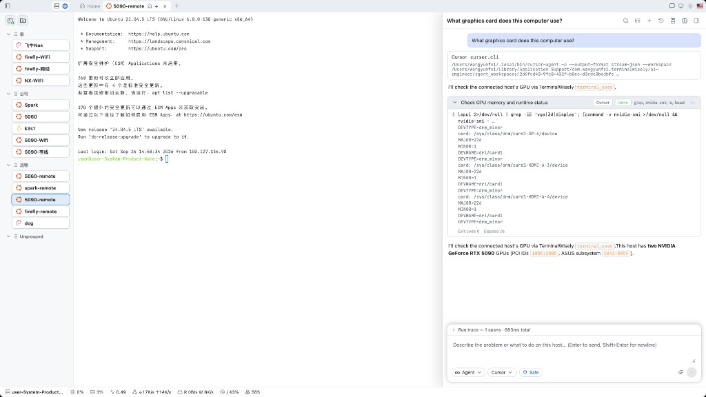
</p>
<p align="center"><em>图 1 — 常规 AI 工程师对话：自然语言提问；Cursor（或其他 Agent）在已连接主机上执行工具，并基于证据回答。</em></p>

---

## 能做什么

| 模块 | 能力 |
|------|------|
| **Agent 运行时** | Cursor Agent / Codex / Claude Code 经 TW MCP 操作已连接 SSH / K8s；双平面 UX（本机 CLI 流 + 远端执行卡片） |
| **终端** | 多标签 SSH、书签、断线重连、中英文界面 |
| **主机 Desktop** | 工作区变成已连接主机的桌面。Dock：文件、进程、浏览器（主机网络）、终端、AI Linux。离开再回来，窗口还在 |
| **主机 Browser** | 经现有 SSH 访问远端 HTTP（含 `127.0.0.1`）；多标签、历史、书签 |
| **Kubernetes** | 侧栏 Hosts ↔ K8s；+ 添加集群（文件或粘贴 kubeconfig）或 SSH kubectl；资源树、YAML、日志、Pod Shell。可一键把最新 kubectl/Helm 装到应用数据目录（也可用 PATH / SSH）。受 Lens 启发的实用子集，非完整 Lens IDE |
| **文件** | 拖拽上传、`ls` 点击进目录或预览；Markdown 类 Typora 所见即所得；下载、压缩、跨服务器发送 |
| **AI 工程师** | Hosts 为 Linux 模式；K8s 为 K8S 模式；长任务续租 SSH；同一条对话切换模型或 Agent 后工作连续 |
| **模型** | OpenAI 兼容、Ollama、Anthropic 兼容网关、Gemini |
| **安全** | 命令能力分级（只读 / 变更 / 拒绝）；批准卡片；随时停止 |
| **可观测** | 状态栏显示 CPU、内存、磁盘读写、网络 |

---

## 模型与 Agent

在输入框下方的选择器里切换 **Model**（你配置的内置模型 Profile）与 **Agent**（本机 CLI）。

<p align="center">
  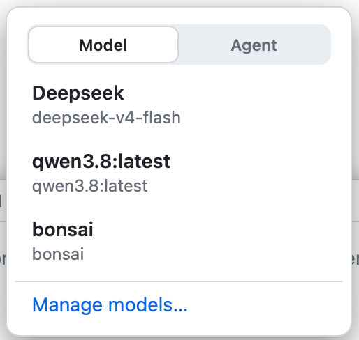
</p>
<p align="center"><em>图 2 — 模型选择：切换已配置的 Profile（OpenAI 兼容、Ollama 等），或进入「管理模型…」。</em></p>

<p align="center">
  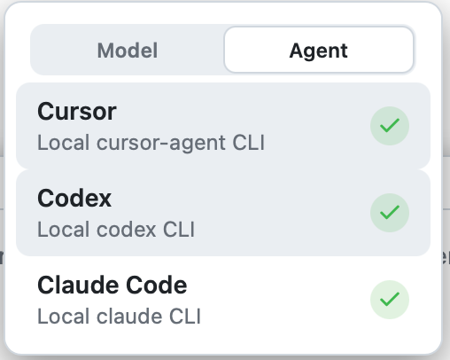
</p>
<p align="center"><em>图 3 — Agent 选择：本机 CLI 就绪时可选 Cursor、Codex、Claude Code。</em></p>

### Cursor / Codex / Claude Code 当作运维 Agent

打开 **AI 工程师** → 选择运行时（**内置**、**Cursor**、**Codex** 或 **Claude Code**）。

- **它们的 Agent，你的会话** — CLI 在本机跑；远端操作经 TW MCP（`terminal_exec`、`k8s_*` …）走你已打开的会话。
- **不另开影子 SSH** — 与终端标签同一租约；长任务会续租。
- **审批仍在 TW** — 能力分级（R0–R4）；变更需目标绑定批准；卡片标注 Agent 来源。
- **安装与登录引导** — CLI 缺失或登录过期会进入引导流，不会后台静默安装。

需本机已安装并登录对应 CLI（Cursor Agent / Codex / Claude Code）。

### 内置 AI Linux 与 K8S Engineer

模式跟随侧栏：

- **Hosts** → **AI Linux Engineer**（已连接 SSH，`terminal_exec`）
- **K8s** → **AI K8S Engineer**（当前集群，`k8s_*` 工具）

- **同一会话 / 集群** — 不另开静默登录；SSH kubectl 走已绑定会话。  
- **先看证据** — 在真机/集群上读输出再下结论。  
- **你说了算** — 只读探测可自动跑；写删改必须在 UI 上批准。  
- **自带模型** — 设置里保存多套 Profile（云端或本地），一键切换当前模型。

### 可以这样问

| 你说 | 它会 |
|------|------|
| 「磁盘满了，找大目录」 | `df` / `du` 逐层查（Linux） |
| 「8080 谁占着」 | 查监听与进程；结束进程需批准 |
| 「这个 Pod 为什么 CrashLoop」 | 在所选集群上 `k8s_describe` / `k8s_logs` |
| 「把 api 扩到 3 副本」 | 批准后 `k8s_scale` |
| 「nginx 502」 | 状态、日志、上游检查 |
| 「现在显存多少」 | `nvidia-smi` 等只读命令 |

---

## 主机桌面

点主机图标。侧栏、标题栏、状态栏不动，右边整块变成这台已连接 Linux 主机的桌面。再点一次，回到终端。离开时打开的窗口和位置，回来还在。

<p align="center">
  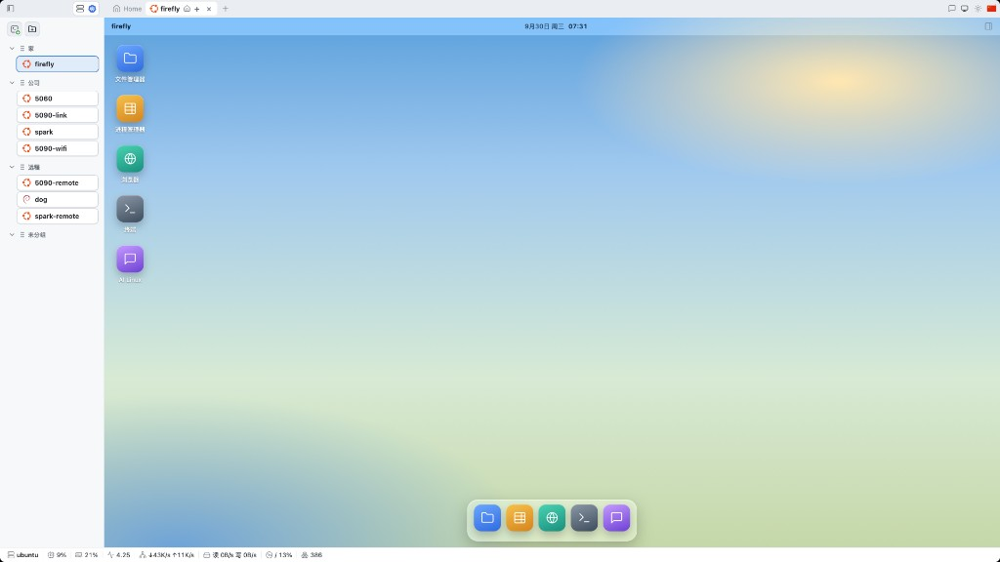
</p>
<p align="center"><em>图 4 — 主机桌面：壁纸、应用图标，以及这台机器上的 Dock。</em></p>

<p align="center">
  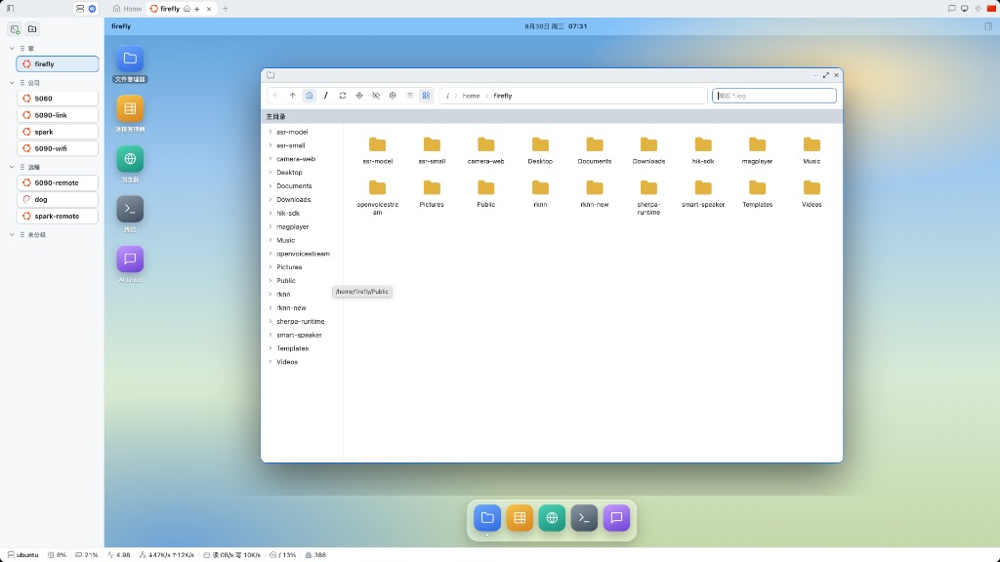
</p>
<p align="center"><em>图 5 — 文件管理器：浏览远端文件系统。</em></p>

<p align="center">
  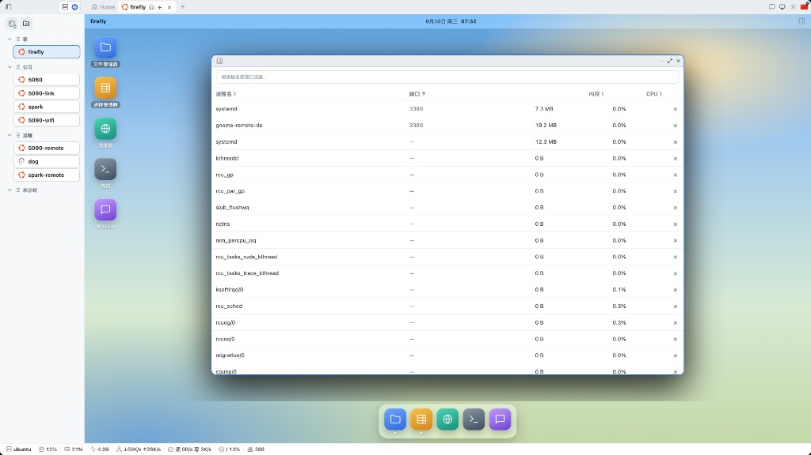
</p>
<p align="center"><em>图 6 — 进程管理器：主机上的进程名、端口、内存与 CPU。</em></p>

<p align="center">
  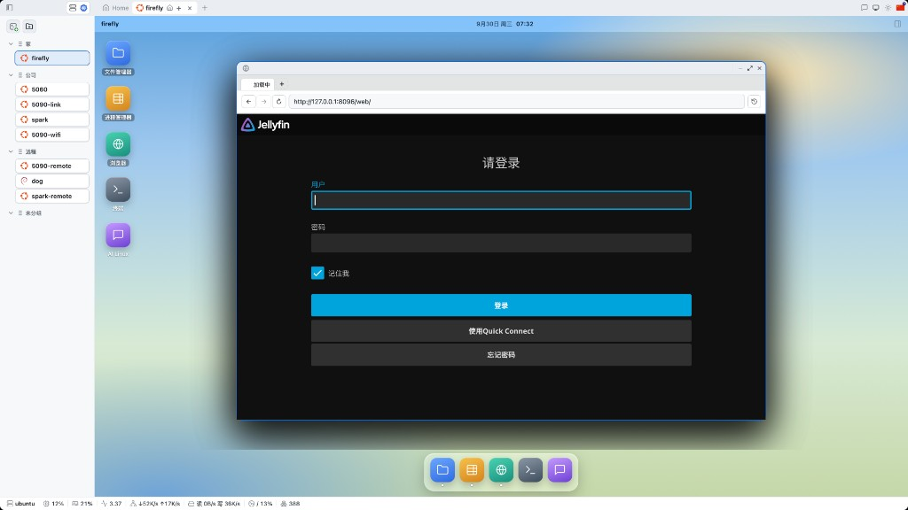
</p>
<p align="center"><em>图 7 — 浏览器用<strong>主机的网络</strong>上网（含 <code>127.0.0.1</code>），走现有 SSH 会话。</em></p>

<p align="center">
  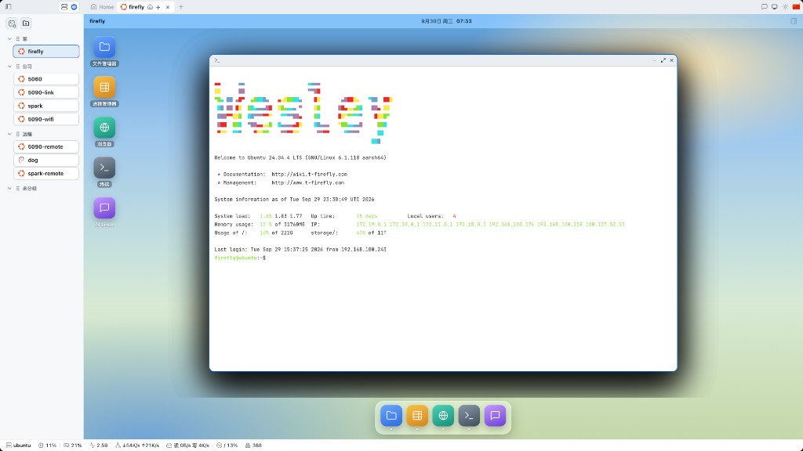
</p>
<p align="center"><em>图 8 — 终端是同一条 SSH 会话，放在桌面窗口里。</em></p>

<p align="center">
  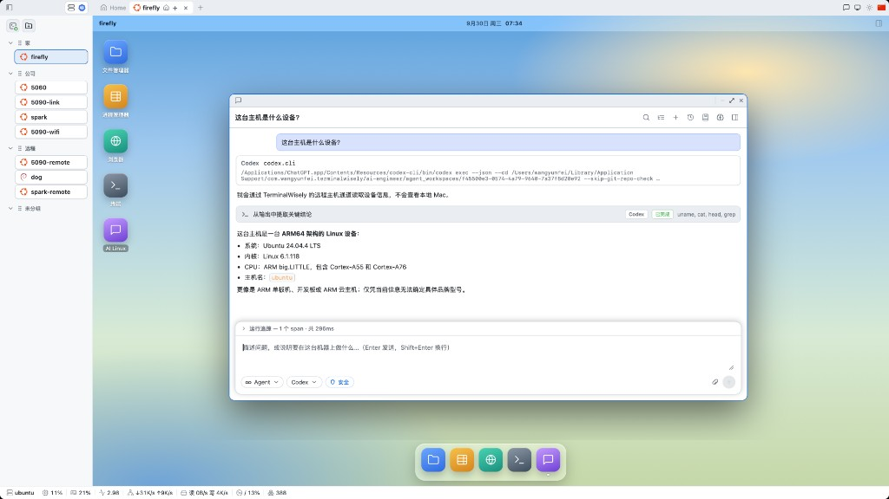
</p>
<p align="center"><em>图 9 — AI Linux 是同一条 AI 工程师对话，铺满桌面窗口。</em></p>

<p align="center">
  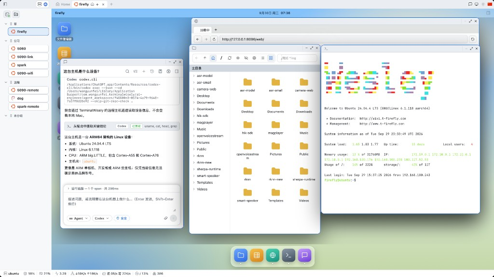
</p>
<p align="center"><em>图 10 — 几个应用同时开着。可以拖动和缩放，最前面的窗口盖在上面。</em></p>

<p align="center">
  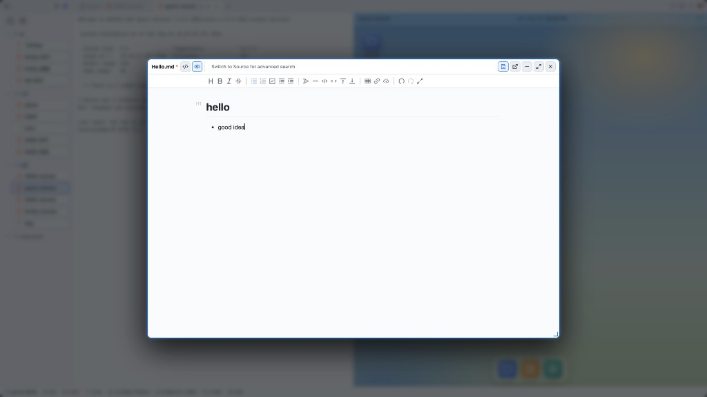
</p>
<p align="center"><em>图 11 — 远端主机上的 Markdown 所见即所得编辑（类 Typora）。</em></p>

<p align="center">
  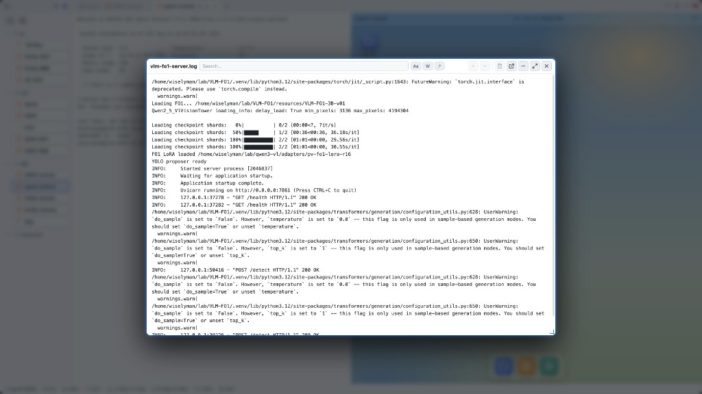
</p>
<p align="center"><em>图 12 — 远端日志等常见文件可预览与搜索。</em></p>

<p align="center">
  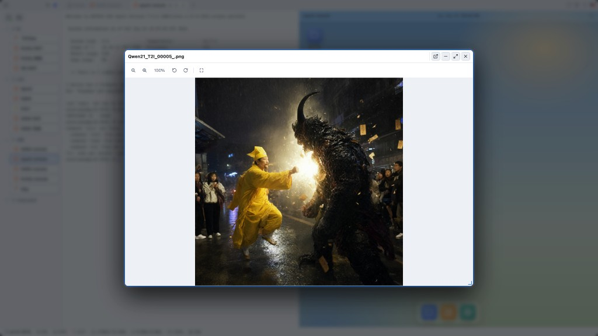
</p>
<p align="center"><em>图 13 — 图片等主流文件类型在预览面板中打开。</em></p>

### 终端与传输

- **上传** — 文件拖到终端或标签 → SFTP 到当前目录  
- **进目录** — 点击 `ls` 里的目录名  
- **预览编辑** — 点击文件路径；Markdown 为类 Typora 所见即所得；文本支持高亮与搜索  
- **下载** — Ctrl/Cmd + 点击路径，或右键菜单  
- **跨服发送** — 右键路径，或拖到另一个 SSH 标签  
- **命令导航** — 90+ 运维命令片段插入终端（不自动执行）

---

## Kubernetes 工作台

侧栏 **Hosts ↔ K8s**：总览、工作负载、网络、存储与安全资源，并在所选集群上使用 AI。

<p align="center">
  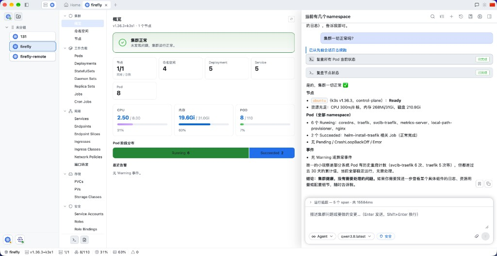
</p>
<p align="center"><em>图 14 — Kubernetes 运维：集群总览 + AI 工程师回答「集群是否正常」。</em></p>

---

## 快速开始

1. 侧栏添加 SSH 主机并连接——或切到 **K8s** 点 **+** 添加集群（kubeconfig 文件或粘贴）。  
2. 可选：点主机图标，打开这台机器的桌面——文件、进程、浏览器、终端、AI Linux。  
3. 可选：打开 **AI 工程师** → 选择运行时（内置模型，或已安装的 Cursor / Codex / Claude Code）。  
4. 内置模式：设置 → 添加模型 Profile（Base URL + 模型名；Ollama 通常免 Key）。  
5. 照常使用终端或 K8s 工作台；需要排障时用自然语言提问。  
6. 对标记为「系统变更」的命令选择批准或拒绝。

Kubernetes 说明：本机操作优先用应用目录中一键安装的 kubectl/Helm（也可回退 PATH）；SSH 跳板机仍用远端 PATH。K8s 界面是受 Lens 启发的实用子集，不是完整 Lens IDE。

---

## 下载

**Windows**、**macOS**（Apple Silicon / Intel）、**Linux**（deb、rpm、AppImage；x86_64 / ARM64）安装包见 [Releases](https://github.com/wiselyman/TerminalWisely/releases)。

AI 运行时已打包在应用内。首次打开 AI 工程师时，会在后台自动完成依赖安装（界面有进度提示）。

### macOS

若打开时提示：

> 「TerminalWisely」已损坏，无法打开。你应该将它移到废纸篓。

应用本身没有损坏，是系统给下载文件加了隔离属性。拖进「应用程序」后，在终端执行：

```bash
xattr -cr /Applications/TerminalWisely.app
```

再打开即可。

---

## 许可证

[MIT](./LICENSE)
