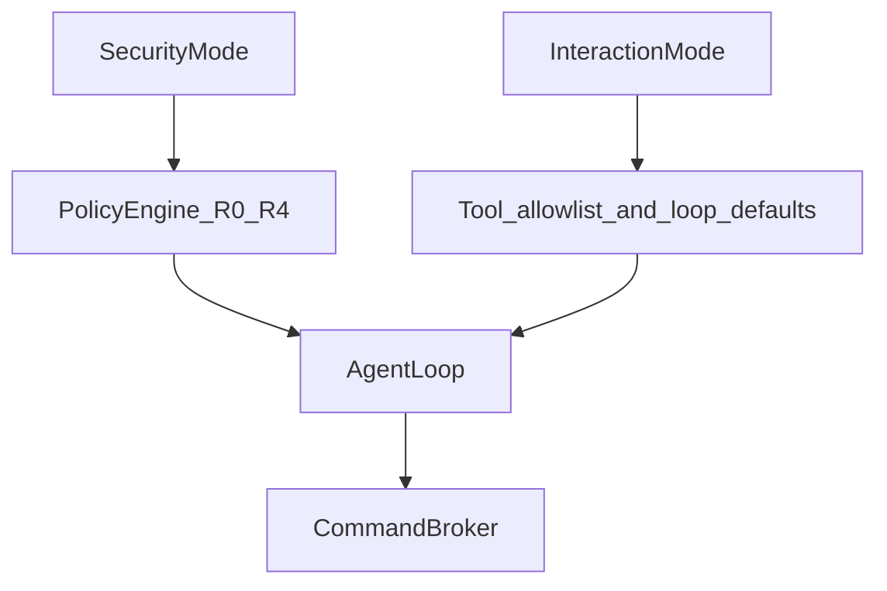

# Interaction modes — Ask / Plan / Agent (orthogonal to SecurityMode)

Date: 2026-08-25  
Status: approved (design; implementation not started)  
Primary iteration companion: see [`2026-08-25-next-iteration-primary.md`](./2026-08-25-next-iteration-primary.md)  
Scope: AI Linux Engineer interaction pose. Does **not** replace SecurityMode.

## Problem

Users need Cursor-like control over **how autonomous the agent behaves** (read-only Q&A vs plan-only vs full act). TerminalWisely already has **SecurityMode** (`observe|safe|autonomous|production`) controlling **how dangerous mutations may be**. Mixing both into one dropdown would confuse “I don’t want changes” with “production dual-confirm”.

## Goal

Add **InteractionMode**: `ask | plan | agent` as a second axis that gates tools and defaults, while SecurityMode remains the PolicyEngine risk posture.

## Non-goals

- Replacing or renaming SecurityMode  
- Multi-agent branches / parallel Agents  
- Guardian model as PolicyEngine substitute  
- Hardcoded troubleshooting trees (workflow chips are prompt+skills only)  

## Two axes

| Axis | Values | Meaning |
|------|--------|---------|
| **SecurityMode** (existing) | observe / safe / autonomous / production | Max mutation risk + approval strictness |
| **InteractionMode** (new) | ask / plan / agent | Whether the loop may mutate / only plan / only investigate |

**Intersection examples**

| Interaction × Security | Behavior |
|------------------------|----------|
| ask × anything | No mutation tools; read-only probes + web + ask_user OK; terminal_exec only if Policy says R0 |
| plan × anything | Prefer `update_plan`; deny / no-op mutation tools and OpsPlan apply; may still read |
| agent × observe | Full loop shape but Policy still blocks mutations (R0 only) |
| agent × production | Full loop + dual-confirm + no session permanent allow shortcuts |

Effective permission = **intersection** (most restrictive wins). InteractionMode never widens SecurityMode.

## Mode semantics

### Ask

- Intent: explain and investigate; user stays in control of changes  
- Tool gate: allow `service_status`, `list_listeners`, `grep_remote_logs`, `read_remote_file`, R0 `terminal_exec`, `web_*`, `ask_user`, `spawn_investigator`; **deny** `submit_ops_plan` apply path, mutation-class exec, persistent-allow prompts irrelevant  
- System prompt addendum: “Ask mode: do not propose executing mutations; describe steps the user could take”  
- Default SecurityMode suggestion: leave user choice; if unset, keep thread’s current mode  

### Plan

- Intent: produce / update checklist and written plan only  
- Tool gate: allow `update_plan`, read-only probes, web, ask_user; **deny** host mutation and OpsPlan execution  
- May call investigator for evidence then fold into plan  
- UI: Plan sticky bar remains primary artifact  

### Agent

- Intent: today’s full loop (investigate → approve → mutate → verify)  
- Tool gate: current tool set  
- No behavior regression vs pre-mode product  

## Persistence & FE

| Topic | Decision |
|-------|----------|
| Storage | Per `ChatThread`, field `interactionMode` (default `agent`) alongside `securityMode` |
| UI | Composer or header segmented control: Ask · Plan · Agent (i18n); keep SecurityModePicker as today |
| API | Pass `interaction_mode` on `/v1/chat/start` and continue; sidecar stores on `AgentRun.metadata` / run field |
| Switch mid-thread | Allowed between turns; mid-run switch = stop then re-send policy (same as interrupt send) — do not hot-swap mid-approval without cancel |

Supersedes older Cursor-UI non-goal “No Agent/Ask pills” for Linux Engineer product direction ([`2026-08-15-ai-engineer-cursor-ui-design.md`](./2026-08-15-ai-engineer-cursor-ui-design.md) historical).

## Sidecar enforcement (mandatory)

Do **not** rely on model obedience alone:

1. `tools_dispatch` / schema filter: `tools_for_interaction_mode(mode)`  
2. Pipeline pre-hook: deny disallowed tool names with stable error payload  
3. Prompt addendum from mode (defense in depth only)  

## Workflow entry chips (thin, with this tranche or context-ingest)

| Topic | Decision |
|-------|----------|
| UI | 3–6 empty-state chips: e.g. ports, systemd, disk, nginx 502 |
| Action | Prefill composer with localized prompt template + tag hints for [`skills/match.py`](../../agent-sidecar/app/skills/match.py) |
| Not | Fixed decision trees / auto-run without user send |

Chips respect current InteractionMode (Ask chip text stays observational).

## Tests

- Unit: Ask mode rejects `submit_ops_plan` / mutating terminal_exec at pipeline  
- Unit: Plan mode allows `update_plan`, rejects mutation  
- Unit: Agent × observe still Policy-denies R2  
- FE: thread persists `interactionMode` in v2 chat storage  

## Success criteria

1. User can switch Ask and see only read-only tool use on a scripted run  
2. Plan mode updates checklist without host mutation events  
3. SecurityMode production + Agent still dual-confirms  
4. No confusion: two controls labeled differently in UI (“Safety” vs “Mode” or equivalent i18n)  

## Implementation order (when coding)

1. Types + API field + thread persistence  
2. Sidecar tool filter + tests  
3. FE segmented control + i18n  
4. Workflow chips (optional same PR)  
